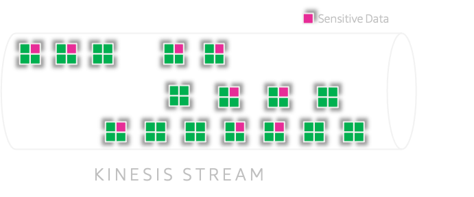
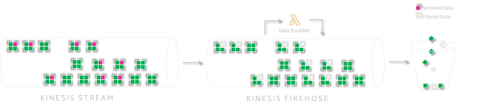
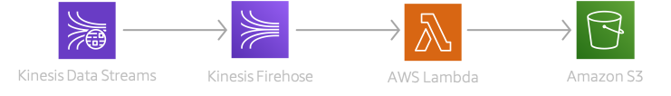

# Scrub Sensitive Data from Event Streams - Kinesis

Mystique Unicorn App uses streams to handle events between their microservices. One of those streams receives events with sensitive data. They have recently decided to give freedom to their customers and updated their privacy policy with an _opt-out_ policy. This enables customers to `allow` or `dis-allow` their consent for data sharing. Commonly referred to as **Data anonymization**.

>Data anonymization _has been defined as a process by which personal data is irreversibly altered in such a way that a data subject can no longer be identified directly or indirectly, either by the data controller alone or in collaboration with any other party_.\
Source: Wikipedia

As their AWS solutions architect can you help them implement this privacy policy in their stream?


## 🎯 Solutions

AWS offers multiple capabilities to process streaming events.They are using kinesis data streams to ingest the stream of customer events. The event payload will look the event shown below. In our demo, we are going to _assume_ only `dob` and `ssn` are sensitive information that needs to be scrubbed if the consent is `False`

```json
{
  "name": "Gnoll",
  "dob": "2011-04-22",
  "gender": "M",
  "ssn_no": "807831104",
  "data_share_consent": False,
  "evnt_time": "2021-01-31T20:31:26.114917"
}
```



We can leverage Kinesis firehose capability to implement a lambda function that can scrub sensitive data based on the feature flag `data_share_consent`. This feature flag allows us to scrub data only for customers who have chosen to _opt-out_ from the data sharing.  Once we have scrubbed the data, we will fill those fields with `REDACTED_CONTENT` as standard text and add an additional boolean field `data_redacted`. In future, if we want to quickly collate or further process these events this flag will be helpful. 



```json
{
  "name": "Gnoll",
  "dob": "REDACTED_CONTENT",
  "gender": "M",
  "ssn_no": "REDACTED_CONTENT",
  "data_share_consent": False,
  "evnt_time": "2021-01-31T20:31:26.114917",
  "data_redacted": True
}
```

Another potential feature flat we can add is the `timestamp` of when the data was scrubbed. I will leave that as an additional exervice for the you. After successfully processing the events, We will persist those events in S3. The final AWS architecture looks something like,


In this article, we will build an architecture, similar to the one shown above. We will start backwards so that all the dependencies are satisfied.

1.  ## 🧰 Prerequisites

    This demo, instructions, scripts and cloudformation template is designed to be run in `us-east-1`. With few modifications you can try it out in other regions as well(_Not covered here_).

    - 🛠 AWS CLI Installed & Configured - [Get help here](https://youtu.be/TPyyfmQte0U)
    - 🛠 AWS CDK Installed & Configured - [Get help here](https://www.youtube.com/watch?v=MKwxpszw0Rc)
    - 🛠 Python Packages, _Change the below commands to suit your OS, the following is written for amzn linux 2_
      - Python3 - `yum install -y python3`
      - Python Pip - `yum install -y python-pip`
      - Virtualenv - `pip3 install virtualenv`

1.  ## ⚙️ Setting up the environment

    - Get the application code

      ```bash
      git clone https://github.com/miztiik/sensitive-data-filter-instream
      cd sensitive-data-filter-instream
      ```

1.  ## 🚀 Prepare the dev environment to run AWS CDK

    We will use `cdk` to make our deployments easier. Lets go ahead and install the necessary components.

    ```bash
    # You should have npm pre-installed
    # If you DONT have cdk installed
    npm install -g aws-cdk

    # Make sure you in root directory
    python3 -m venv .venv
    source .venv/bin/activate
    pip3 install -r requirements.txt
    ```

    The very first time you deploy an AWS CDK app into an environment _(account/region)_, you’ll need to install a `bootstrap stack`, Otherwise just go ahead and deploy using `cdk deploy`.

    ```bash
    cdk bootstrap
    cdk ls
    # Follow on screen prompts
    ```

    You should see an output of the available stacks,

    ```bash
    sensitive-data-producer-stack
    sensitive-data-filter-stack
    ```

1.  ## 🚀 Deploying the application

    Let us walk through each of the stacks,

    - **Stack: sensitive-data-producer-stack**

      This stack will create a kinesis data stream and the producer lambda function. Each lambda runs for a minute ingesting stream of events. The feature flag `data_share_consent` will randomly toggle between `True` and `False` giving us both types of payload in our stream.

      Initiate the deployment with the following command,

      ```bash
      cdk deploy sensitive-data-producer-stack
      ```

      After successfully deploying the stack, Check the `Outputs` section of the stack. You will find the `streamDataProcessor` producer lambda function. We will invoke this function later during our testing phase.

    - **Stack: sensitive-data-filter-stack**

      This stack will create the firehose stack to receive the stream of events from kinesis data stream. This stack will also provision a lambda 

      Initiate the deployment with the following command,

      ```bash
      cdk deploy sensitive-data-filter-stack
      ```

      After successfully deploying the stack, Check the `Outputs` section of the stack. You will find the `SensitiveDataFilter` lambda function and the  `FirehoseDataStore` where the customer events will be stored eventually.

1.  ## 🔬 Testing the solution

    1. **Invoke Producer Lambda**:
      Let us start by invoking the lambda from the producer stack `sensitive-data-producer-stack` using the AWS Console. If you want to ingest more events, use another browser window and invoke the lambda again.
          ```json
          {
            "statusCode": 200,
            "body": "{\"message\": {\"status\": true, \"record_count\": 1168}}"
          }
          ```
        Here in this invocation, the prodcuer has ingested about `1168` customer events to the stream.
    1. **Check FirehoseDataStore**:

       After about `60` seconds, Navigate to the data store S3 Bucket created by the firehose stack `sensitive-data-filter-stack`. You will be able to find an object key similar to this `sensitive-data-filter-stack-fhdatastore6289deb2-1h8i5lr61plswphi-data/2021/02/01/21/phi_data_filter-1-2021-02-01-21-44-38-2ee4ff4d-5019-4eaf-a910-9b2d1ad0ed2b`. 

       Kinesis firehose does not have a native mechanism to set the file extension. I was not too keen on setting up another lambda to add the suffix. But the file contents should be one valid `JSON` object per line.

      The contents of the file should look like this, 
      ```json
      ...
      {"name": "Shardmind", "dob": "REDACTED_CONTENT", "gender": "F", "ssn_no": "REDACTED_CONTENT", "data_share_consent": false, "evnt_time": "2021-01-31T22:09:45.008532", "data_redacted": true}
      {"name": "Kalashtar", "dob": "1942-09-05", "gender": "M", "ssn_no": "231793521", "data_share_consent": true, "evnt_time": "2021-01-31T22:09:45.591946"}
      {"name": "Vedalken", "dob": "1954-06-18", "gender": "F", "ssn_no": "288109737", "data_share_consent": true, "evnt_time": "2021-01-31T22:09:45.631935"}
      ...
      {"name": "Half-Orc", "dob": "REDACTED_CONTENT", "gender": "M", "ssn_no": "REDACTED_CONTENT", "data_share_consent": false, "evnt_time": "2021-01-31T22:09:45.691951", "data_redacted": true}
      {"name": "Lizardfolk", "dob": "REDACTED_CONTENT", "gender": "F", "ssn_no": "REDACTED_CONTENT", "data_share_consent": false, "evnt_time": "2021-01-31T22:09:45.752012", "data_redacted": true}
      {"name": "Half-Elf", "dob": "1951-05-19", "gender": "F", "ssn_no": "533665204", "data_share_consent": true, "evnt_time": "2021-01-31T22:09:45.811942"}
      ...
      ```

      You can observe that the sensitive information for customer who have opted to not share has been scrubbed.


1.  ## 📒 Conclusion

    Here we have demonstrated how to use kinesis firehose and lambda function to scrub sensitive data from streaming events. You can extend this further by enriching the item before storing in S3 or partitioning it better for ingesting into data lake platforms.

1.  ## 🧹 CleanUp

    If you want to destroy all the resources created by the stack, Execute the below command to delete the stack, or _you can delete the stack from console as well_

    - Resources created during [Deploying The Application](#-deploying-the-application)
    - Delete CloudWatch Lambda LogGroups
    - _Any other custom resources, you have created for this demo_

    ```bash
    # Delete from cdk
    cdk destroy

    # Follow any on-screen prompts

    # Delete the CF Stack, If you used cloudformation to deploy the stack.
    aws cloudformation delete-stack \
      --stack-name "MiztiikAutomationStack" \
      --region "${AWS_REGION}"
    ```

    This is not an exhaustive list, please carry out other necessary steps as maybe applicable to your needs.

## 📌 Who is using this

This repository aims to show how to perform data scrubbing from events to new developers, Solution Architects & Ops Engineers in AWS. Based on that knowledge these Udemy [course #1][103], [course #2][102] helps you build complete architecture in AWS.

### 💡 Help/Suggestions or 🐛 Bugs

Thank you for your interest in contributing to our project. Whether it is a bug report, new feature, correction, or additional documentation or solutions, we greatly value feedback and contributions from our community. [Start here](/issues)

### 👋 Buy me a coffee

[](https://ko-fi.com/Q5Q41QDGK) Buy me a [coffee ☕][900].

### 📚 References

1. [Docs: Kinesis Analytics Tumbling Windows - Flink][1]

1. [Docs: Kinesis Streaming Analytics - GROUP BY][2]

1. [Docs: Tumbling Window Using an Event Timestamp][3]

1. [Blog: Kinesis Firehose S3 Custom Prefix][4]

1. [Docs: Kinesis Firehose S3 Custom Prefix][5]

1. [Docs: Kinesis Analytics IAM Role][6]


### 🏷️ Metadata


**Level**: 300

[1]: https://docs.aws.amazon.com/kinesisanalytics/latest/java/examples-tumbling.html
[2]: https://docs.aws.amazon.com/kinesisanalytics/latest/dev/tumbling-window-concepts.html
[3]: https://docs.aws.amazon.com/kinesisanalytics/latest/dev/examples-window-tumbling-event.html
[4]: https://aws.amazon.com/blogs/big-data/amazon-kinesis-data-firehose-custom-prefixes-for-amazon-s3-objects/
[5]: https://docs.aws.amazon.com/firehose/latest/dev/s3-prefixes.html
[6]: https://docs.aws.amazon.com/kinesisanalytics/latest/dev/iam-role.html#iam-role-trust-policy

[100]: https://www.udemy.com/course/aws-cloud-security/?referralCode=B7F1B6C78B45ADAF77A9
[101]: https://www.udemy.com/course/aws-cloud-security-proactive-way/?referralCode=71DC542AD4481309A441
[102]: https://www.udemy.com/course/aws-cloud-development-kit-from-beginner-to-professional/?referralCode=E15D7FB64E417C547579
[103]: https://www.udemy.com/course/aws-cloudformation-basics?referralCode=93AD3B1530BC871093D6
[899]: https://www.udemy.com/user/n-kumar/
[900]: https://ko-fi.com/miztiik
[901]: https://ko-fi.com/Q5Q41QDGK
